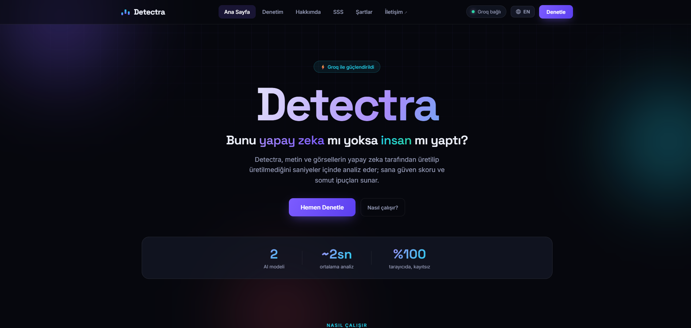
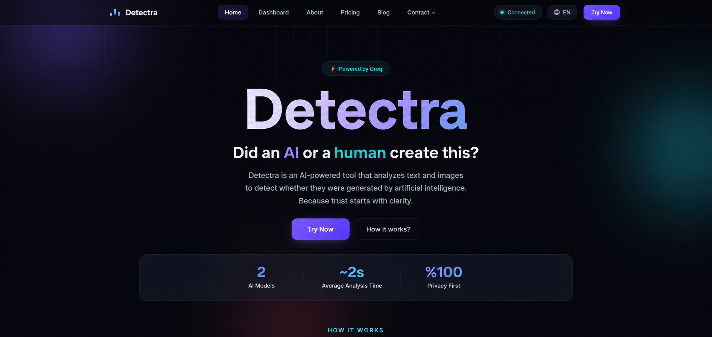
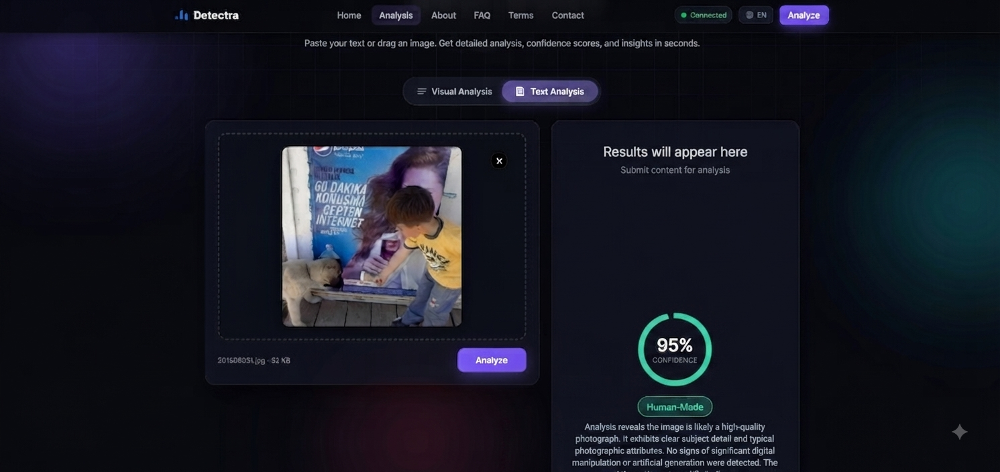
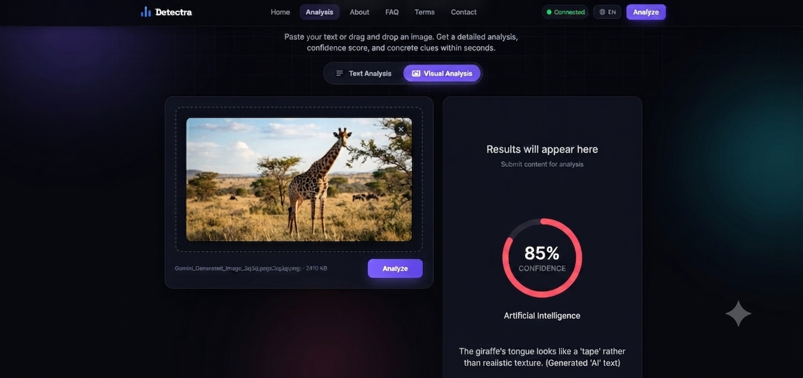
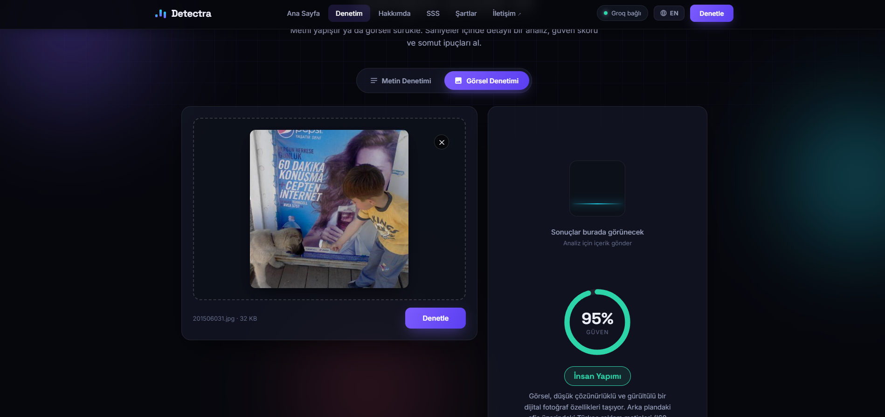
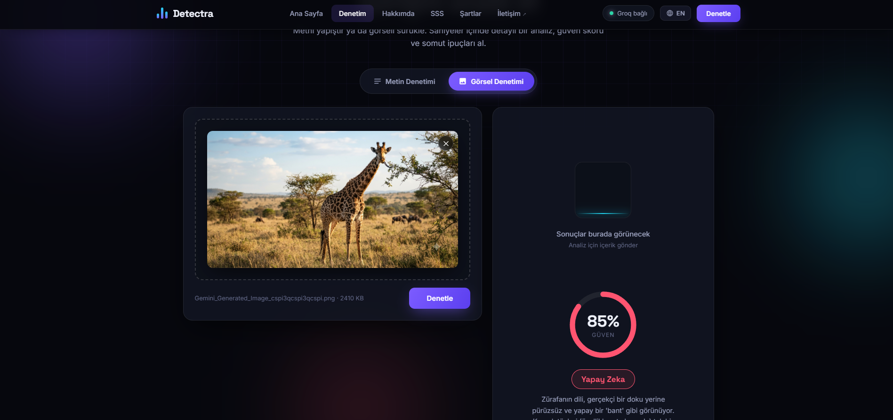

<h1 align="center">🛰️ Detectra AI</h1>
<p align="center">Detectra AI is a Groq-powered web app for spotting AI-generated text and images with confidence scores, structured explanations and visual indicators.</p>
<p align="center">Detectra AI, metin ve görsellerin yapay zeka tarafından oluşturulup oluşturulmadığını Groq tabanlı modellerle analiz eden, güven skoru, açıklama ve somut tespit ipuçları sunan modern bir web uygulamasıdır.</p>

<p align="center">
  
  
  
  
  
  
</p>

<p align="center">
  <a href="#-english">🌐 English</a> •
  <a href="#-türkçe">🇹🇷 Türkçe</a>
</p>

---

<p align="center"></p>

<br>

<h1 align="center" id="-english">🌐 English</h1>
<hr>

## 📖 About

**Detectra** is a web app that analyzes whether text and images were generated by artificial intelligence, through a modern, dark-themed interface. Paste a piece of writing or drop an image and the app sends it — through its own Node.js/Express backend — to a Groq-hosted LLM (`server.js`), which acts as a forensic analyst and returns an **AI / human / uncertain** verdict, a 0–100 confidence score, a short written rationale and a list of concrete indicators. Text is analyzed by a large language model for stylistic tells, while images are inspected by a vision model for anatomical and textural inconsistencies. The interface is a single-page app with hash-based routing and six pages: home, the detector tool, an about page, an FAQ, the terms of use and a contact page.

## ✨ Features

**AI text detection**
- Detects AI signatures such as templated sentence structure, over-polished tone, artificial balance and cliché phrasing
- Powered by a Groq-hosted large language model in strict JSON mode

**AI image detection**
- Inspects anatomical errors, plastic/airbrushed textures, inconsistent light and reflections, and melting background details
- Uses a Groq vision model that reasons over the image before answering, improving accuracy

**Confidence scoring & indicators**
- Every result comes with an animated confidence ring (0–100) and a color-coded verdict
- Not just a label — the model explains its reasoning as bullet-point indicators

**Privacy-focused**
- Submitted content is processed only for the live analysis and is never written to a database

**Bilingual interface (TR / EN)**
- One-click language toggle in the navbar switches the entire UI between Turkish and English
- The choice is remembered in `localStorage` (first visit defaults to the browser language)
- The language is also sent to the backend, so the AI's explanation and indicators come back in the selected language

**Modern multi-page interface**
- A dark-themed single-page app with a sticky full-width navbar, smooth page transitions, animated background and a fully responsive layout

## 🛠️ Tech Stack

- **Node.js** — runtime
- **Express** — lightweight web server and static host
- **Groq API** — LLM & vision inference for the detection verdicts
- **Vanilla HTML / CSS / JS** — dependency-free front-end, zero build step
- **dotenv** — loads the Groq API key from environment variables

## 📸 Screenshots

<p align="center"></p>
<p align="center"><em>English home experience — landing page, CTAs and feature summary.</em></p>

<p align="center"></p>
<p align="center"><em>English detector interface — text/image mode selector and upload flow.</em></p>

<p align="center"></p>
<p align="center"><em>English result panel — verdict, confidence ring and indicator breakdown.</em></p>

## ⚙️ How it works

- **`server.js`** — the Express backend; serves the static front-end and exposes the analysis API:
  - `POST /api/analyze-text` — sends the text to the Groq text model and returns a normalized verdict (accepts a `lang` field to pick the response language)
  - `POST /api/analyze-image` — sends the image to the Groq vision model and returns a normalized verdict (accepts a `lang` field to pick the response language)
  - `GET /api/health` — reports whether the Groq API key is configured
- **`public/`** — the front-end:
  - `index.html` — the six-page single-page app (home, tool, about, FAQ, terms, contact), with every string tagged via `data-i18n` attributes
  - the **contact page** offers a form that builds a pre-filled `mailto:` message from your input, plus a direct email link
  - `styles.css` — the dark theme, layout and animations
  - `app.js` — the hash router, the tool logic (tabs, text/image analysis, result rendering) and UI helpers
  - `i18n.js` — the TR/EN dictionary and language engine (swaps text, remembers the choice, updates `<html lang>`)
- **`baslat.bat`** — a Windows helper that starts the server, prints the local URL and opens the site in your default browser automatically

The Groq API key is read from environment variables via `dotenv` — see [Usage](#-usage) below.

## 📁 Project Structure

```
Detectra/
├── server.js              # Express backend + Groq proxy API
├── package.json            # Scripts and dependencies
├── baslat.bat               # Windows start helper
├── public/                   # Front-end
│   ├── index.html             # Multi-page single-page app
│   ├── styles.css              # Dark theme, layout, animations
│   ├── app.js                   # Hash router + detector logic
│   └── i18n.js                   # TR/EN dictionary + language engine
├── img/                          # Screenshots used in this README
├── .env.example                   # Template for GROQ_API_KEY
├── LICENSE
└── README.md
```

## 🚀 Usage

1. Clone the repository
   ```bash
   git clone https://github.com/AlperT-Code/Detectra.git
   cd Detectra
   ```
2. Install dependencies (Node.js 18+ recommended)
   ```bash
   npm install
   ```
3. Copy `.env.example` to `.env` and set your own free Groq API key from [console.groq.com](https://console.groq.com):
   ```bash
   copy .env.example .env
   ```
4. Run it
   ```bash
   npm start
   ```
   Then open **http://localhost:3000** in your browser. On Windows you can also just double-click `baslat.bat`, which starts the server and opens the site for you automatically.

## 🤝 Contributing

1. Fork the repository
2. Create a new branch
3. Commit your changes
4. Push the branch
5. Open a pull request

## 📝 License

This project is licensed under the [MIT License](LICENSE).

<br><br><br><br>

<h1 align="center" id="-türkçe">🇹🇷 Türkçe</h1>
<hr>

## 📖 Hakkında

**Detectra**, metin ve görsellerin yapay zeka tarafından üretilip üretilmediğini modern, koyu temalı bir arayüz üzerinden analiz eden bir web uygulamasıdır. Bir yazı yapıştırır ya da bir görsel bırakırsınız; uygulama bunu kendi Node.js/Express sunucusu üzerinden bir Groq LLM'ine (`server.js`) gönderir — model bir adli analist gibi davranarak **yapay zeka / insan / belirsiz** kararı, 0–100 arası bir güven skoru, kısa bir yazılı gerekçe ve somut ipuçları listesi döndürür. Metin, üslup ipuçları için bir büyük dil modeli tarafından; görseller ise anatomik ve dokusal tutarsızlıklar için bir görüntü modeli tarafından incelenir. Arayüz; hash tabanlı yönlendirmeye sahip, altı sayfalı (ana sayfa, denetim aracı, hakkımda, SSS, kullanım şartları ve iletişim) tek sayfa bir uygulamadır.

## ✨ Özellikler

**Yapay zeka metin denetimi**
- Kalıplaşmış cümle yapısı, aşırı cilalı ton, yapay denge ve klişe ifadeler gibi AI imzalarını tespit eder
- Katı JSON modunda çalışan bir Groq büyük dil modeliyle güçlendirilmiştir

**Yapay zeka görsel denetimi**
- Anatomik hatalar, plastik/airbrush dokular, tutarsız ışık ve yansımalar, eriyen arka plan detaylarını inceler
- Yanıt vermeden önce görsel üzerinde akıl yürüten bir Groq görüntü modeli kullanır, bu da doğruluğu artırır

**Güven skoru ve ipuçları**
- Her sonuç, animasyonlu bir güven halkası (0–100) ve renk kodlu bir kararla gelir
- Sadece bir etiket değil — model gerekçesini madde madde ipuçları olarak açıklar

**Gizlilik odaklı**
- Gönderilen içerik yalnızca anlık analiz için işlenir ve asla bir veritabanına yazılmaz

**İki dilli arayüz (TR / EN)**
- Navbar'daki tek tuşluk dil butonu tüm arayüzü Türkçe ve İngilizce arasında anında değiştirir
- Seçim `localStorage`'da hatırlanır (ilk ziyarette tarayıcı diline göre başlar)
- Dil sunucuya da iletilir; böylece AI'ın açıklaması ve ipuçları seçilen dilde döner

**Modern çok sayfalı arayüz**
- Yapışkan tam genişlik navbar, akıcı sayfa geçişleri, animasyonlu arka plan ve tamamen duyarlı bir yerleşime sahip koyu temalı tek sayfa uygulaması

## 🛠️ Kullanılan Teknolojiler

- **Node.js** — çalışma ortamı
- **Express** — hafif web sunucusu ve statik dosya sunumu
- **Groq API** — tespit kararları için LLM ve görüntü çıkarımı
- **Düz HTML / CSS / JS** — bağımlılıksız arayüz, sıfır build adımı
- **dotenv** — Groq API anahtarını ortam değişkenlerinden yükler

## 📸 Ekran Görüntüleri

<p align="center"></p>
<p align="center"><em>Türkçe ana sayfa — gövde metni, CTA butonları ve istatistik kartı.</em></p>

<p align="center"></p>
<p align="center"><em>Türkçe denetim aracı — metni yapıştırın ya da görsel bırakın, ardından sonuç panelini görün.</em></p>

<p align="center"></p>
<p align="center"><em>Türkçe sonuç paneli — karar, güven oranı ve somut ipuçları.</em></p>

## ⚙️ Nasıl Çalışıyor

- **`server.js`** — Express sunucusu; statik arayüzü sunar ve analiz API'sini açar:
  - `POST /api/analyze-text` — metni Groq metin modeline gönderir ve normalleştirilmiş bir karar döndürür
  - `POST /api/analyze-image` — görseli Groq görüntü modeline gönderir ve normalleştirilmiş bir karar döndürür
  - `GET /api/health` — Groq API anahtarının tanımlı olup olmadığını bildirir
- **`public/`** — arayüz:
  - `index.html` — altı sayfalı tek sayfa uygulama (ana sayfa, araç, hakkımda, SSS, şartlar, iletişim)
  - **iletişim sayfası** — girdiğin bilgilerden önceden doldurulmuş bir `mailto:` mesajı oluşturan bir form ve doğrudan e-posta bağlantısı sunar
  - `styles.css` — koyu tema, yerleşim ve animasyonlar
  - `app.js` — hash yönlendiricisi, araç mantığı (sekmeler, metin/görsel analizi, sonuç render'ı) ve arayüz yardımcıları
- **`baslat.bat`** — sunucuyu başlatan, yerel adresi yazan ve siteyi varsayılan tarayıcında otomatik açan Windows yardımcısı

Groq API anahtarı `dotenv` ile ortam değişkenlerinden okunur — aşağıdaki [Kullanım](#-kullanım) bölümüne bakın.

## 📁 Proje Yapısı

```
Detectra/
├── server.js              # Express sunucusu + Groq proxy API'si
├── package.json            # Komutlar ve bağımlılıklar
├── baslat.bat               # Windows başlatma yardımcısı
├── public/                   # Arayüz
│   ├── index.html             # Çok sayfalı tek sayfa uygulama
│   ├── styles.css              # Koyu tema, yerleşim, animasyonlar
│   ├── app.js                   # Hash yönlendirici + dedektör mantığı
│   └── i18n.js                  # TR/EN sözlüğü ve dil motoru
├── img/                          # Bu README'de kullanılan ekran görüntüleri
├── .env.example                   # GROQ_API_KEY için şablon
├── LICENSE
└── README.md
```

## 🚀 Kullanım

1. Depoyu klonlayın
   ```bash
   git clone https://github.com/AlperT-Code/Detectra.git
   cd Detectra
   ```
2. Bağımlılıkları kurun (Node.js 18+ önerilir)
   ```bash
   npm install
   ```
3. `.env.example` dosyasını `.env` olarak kopyalayıp [console.groq.com](https://console.groq.com) üzerinden aldığınız ücretsiz Groq API anahtarınızı girin:
   ```bash
   copy .env.example .env
   ```
4. Çalıştırın
   ```bash
   npm start
   ```
   Ardından tarayıcınızda **http://localhost:3000** adresini açın. Windows'ta `baslat.bat` dosyasına çift tıklamanız da yeterlidir; sunucuyu başlatıp siteyi sizin için otomatik açar.

## 🤝 Katkıda Bulunma

1. Projeyi fork'layın
2. Yeni bir branch oluşturun
3. Değişikliklerinizi commit edin
4. Branch'i push edin
5. Pull request oluşturun

## 📝 Lisans

Bu proje [MIT Lisansı](LICENSE) ile lisanslanmıştır.
